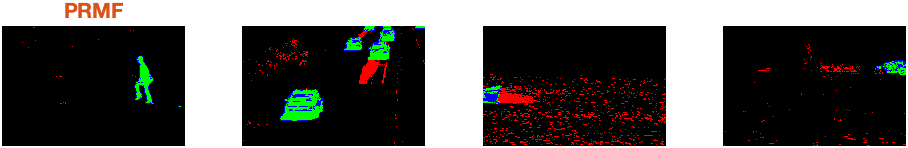
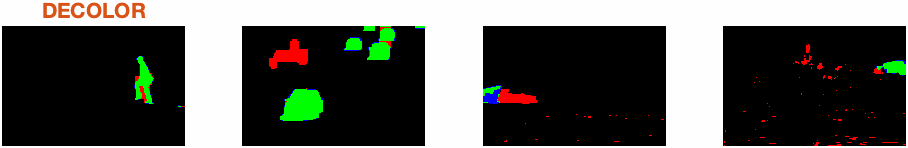
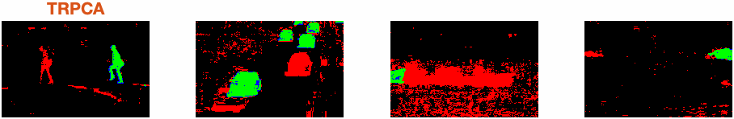
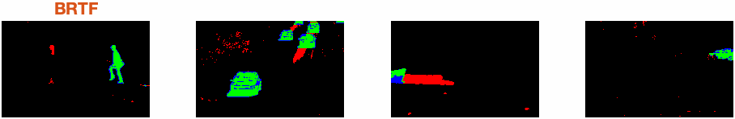
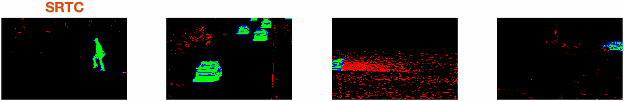
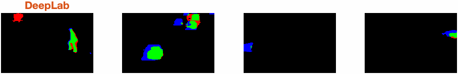
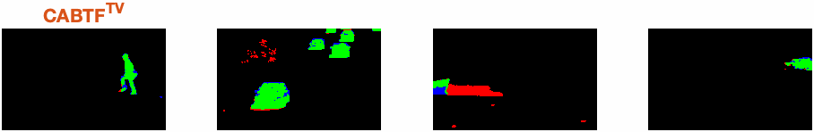
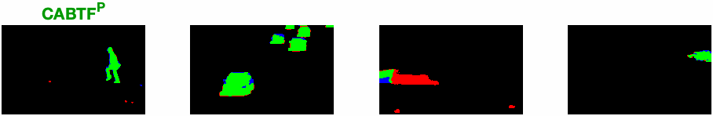

# Context-Aware Bayesian Tensor Factorization (CABTF)
This site contains the examples and complementary material for the paper titled "Robust Unsupervised Video Foreground Segmentation via Context-Aware Bayesian Tensor Factorization" submitted for 2023 INFORMS QSR Best Paper Competition.

Here is a comparision of the Context-Aware Bayesian Tensor Factorization (CABTF) method and benchmarks:

## Contents

 - `Complementary Material`: proofs of propositions, detailed derivations of posteriors, and extra explanation for Fig.3.

